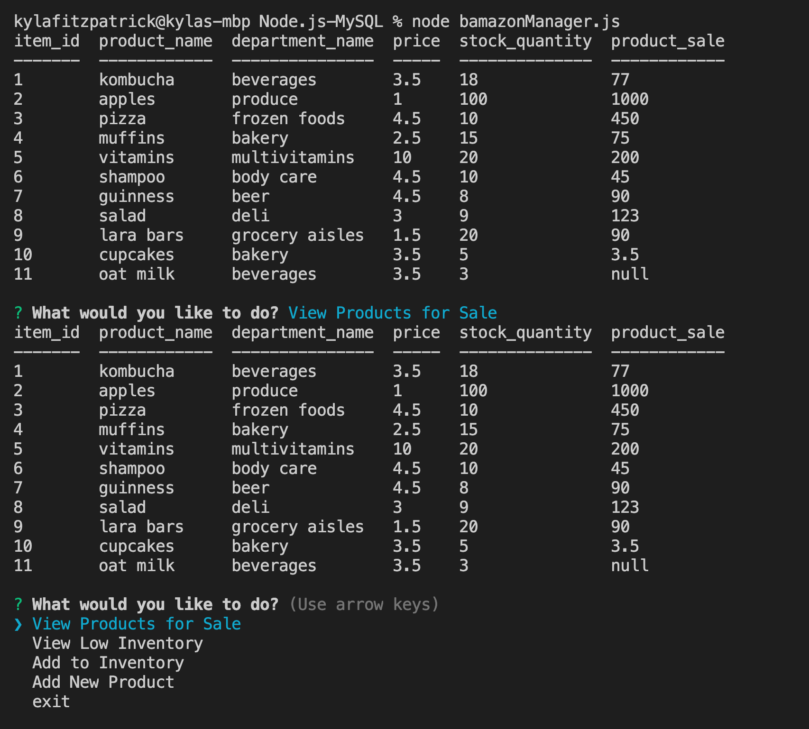
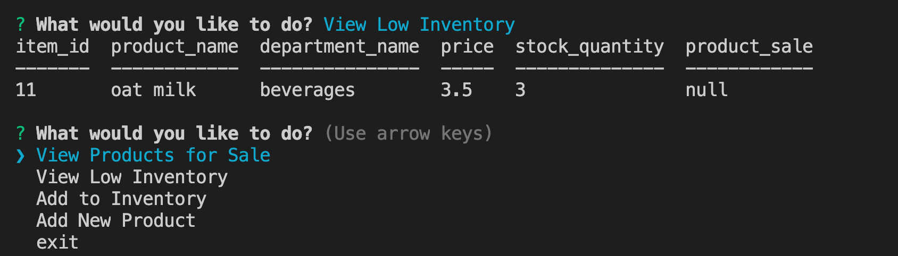
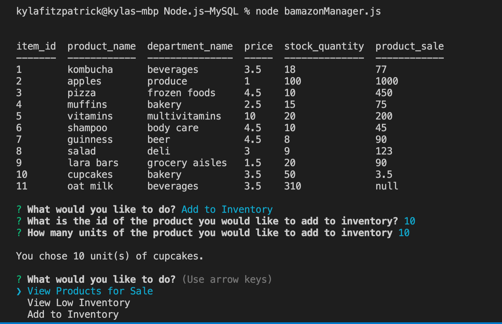
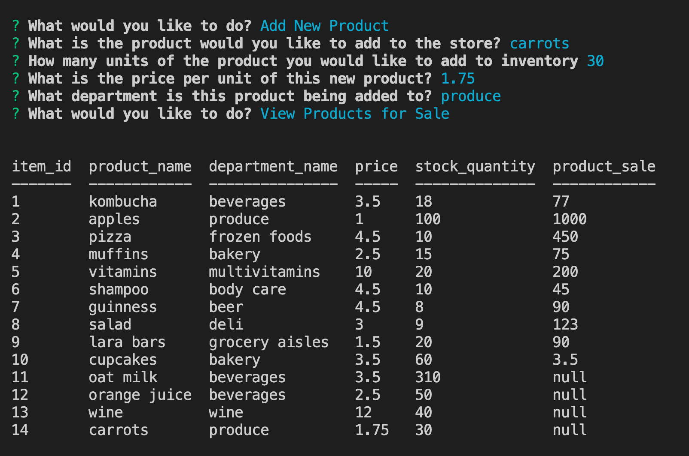
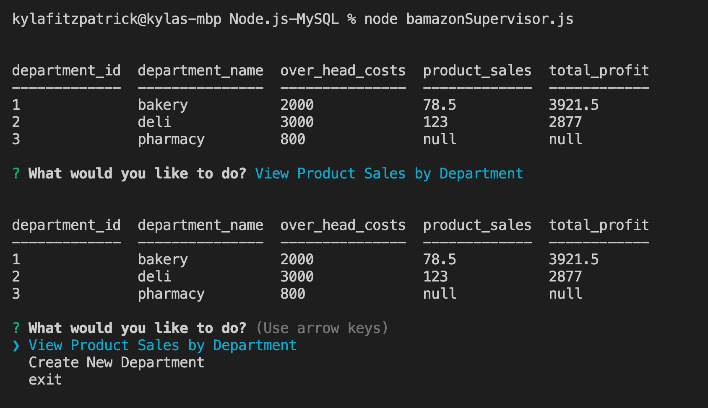
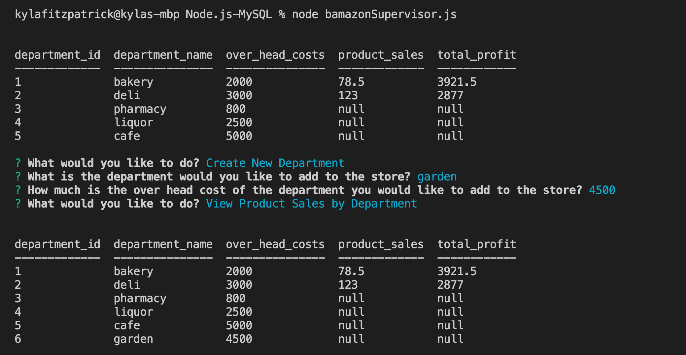

# Node.js-MySQL

### About the app (i.e. what is it doing and why)

This is a Amazon-like storefront. The app will take in orders from customers and decrease stock from the store's inventory. Also, this app tracks product sales across your store's departments and then provide a summary of the highest-grossing departments in the store.

### High-level overview of how the app is organized

Node will run a the app and use inquirer to prompt the user with questions for the customer, manager and supervisor. Based on the answers the user provides the app will call MySQL to retrieve and display date from the database.

### Instructions on how to run the app

Run commands 1-3 to run the bamazon app:

1. node bamazonCustomer.js

 * Prompt users with two messages.
    * ID of the product they would like to buy.
    * how many units of the product they would like to buy.
 * After user inputs answers, application checks if your store has enough of the product to meet the customer's request.
    * If not enough product "Insufficient quantity!" displays, and then prevents the order from going through.
    * If the store does have enough of the product, customer's order is fulfilled and total cost of purchase displays.

2. node bamazonManager.js. 

* List a set of menu options:

    * View Products for Sale

    * View Low Inventory

    * Add to Inventory

    * Add New Product

* If a manager selects "View Products for Sale", the app should list every available item: the item IDs, names, prices, and quantities.

* If a manager selects View Low Inventory, then list all items with an inventory count lower than five.

* If a manager selects Add to Inventory, your app should display a prompt that will let the manager "add more" of any item currently in the store.

* If a manager selects Add New Product, it should allow the manager to add a completely new product to the store.

3. node bamazonSupervisor.js. 

* List a set of menu options:   

    * View Product Sales by Department

    * Create New Department

* When a supervisor selects "View Product Sales by Department", the app displays a summarized table in their terminal/bash window. 

* Columns should display in the table: department_id department_name over_head_costs product_sales total_profit

### Screenshots of the app functioning

1. node bamazonCustomer.js 

* Success

* Insufficient quantity

2. node bamazonManager.js 

* View Products for Sale

* View Low Inventory

* Add to Inventory

* Add New Product

3. node bamazonSupervisor.js

* View Product Sales by Department

* Create New Department

### Contain a link to a deployed version of the app

Repository: https://github.com/KylaFitzpatrick/Node.js-MySQL

### Clearly list the technologies used in the app

I used node to run the app and inquirer for question prompts as well as mysql to store data for the app and responses from the user.

### State your role in the app development

My role in development was using node and inquirer to generate responses from the user as well as using mysql to sotre the data from the user responses. 
